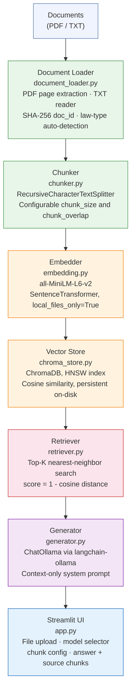

# Offline RAG Bot

> A **fully offline, privacy-first Retrieval-Augmented Generation (RAG)** pipeline for local document Q&A — no API keys, no data leaving your machine, no cloud dependencies.

[](https://python.org)
[](https://streamlit.io)
[](https://www.trychroma.com/)
[](https://ollama.com)
[](LICENSE)

---

## What Is This?

**Offline RAG Bot** is a modular, fully self-contained question-answering system that lets you chat with your own documents — PDFs, legal texts, research papers — using **local language models** running on your hardware.

Built across a clean 6-stage pipeline, this project demonstrates real-world RAG system design: from document ingestion and chunking through dense-vector retrieval to LLM-powered answer generation, all accessible through an interactive Streamlit UI.

**Key demo use-case:** The included document corpus covers **four major international data privacy laws** — GDPR (EU), CCPA (California), LGPD (Brazil), and DPDP (India) — making this a practical tool for privacy compliance exploration, legal research, and education.

---

## Problems This Solves

| Problem | How This Project Solves It |
|---|---|
| **Data privacy when using LLMs** | Runs 100% offline — no document ever leaves your machine |
| **Hallucination in LLM answers** | Strict context-only system prompt: the model answers *only* from retrieved chunks |
| **Cloud API costs & latency** | Local embeddings (Sentence Transformers) + local LLMs (Ollama) = zero API cost |
| **Re-embedding on every run** | Persistent ChromaDB vector store — embeddings are computed once and reused |
| **Inflexible RAG setups** | Each component is a standalone, swappable Python class |
| **Model evaluation difficulty** | Benchmarked 5 open-source LLMs on the same 20-question legal Q&A suite |

---

## Architecture

### Pipeline Overview



---

## Key Features

- **Truly Offline** — `TRANSFORMERS_OFFLINE=1`, `HF_HUB_DISABLE_TELEMETRY=1`, `local_files_only=True` enforced at runtime
- **Flexible Ingestion** — Single file, multiple files, or entire folder; PDF page-level + TXT support
- **Smart Metadata** — Auto-detects law type (GDPR/CCPA/LGPD/DPDP) from filename; attaches doc_id, source, page
- **Persistent Embeddings** — ChromaDB persists to `chroma_db/` directory; no re-embedding needed across sessions
- **Fully Configurable UI** — `chunk_size`, `chunk_overlap`, `top_k`, `temperature`, model selection — all from the sidebar
- **Source Transparency** — Every answer includes retrieved chunks, source document, page number, and cosine similarity score
- **Multi-Model Evaluation** — Benchmarked across 5 small open-source LLMs on 20 privacy-law questions

---

## Model Evaluation

Five small, consumer-hardware-friendly LLMs were evaluated on a 20-question legal Q&A benchmark using the bundled privacy-law corpus:

| Model | Size | Evaluation Output |
|---|---|---|
| `gemma3:270m` | ~270M params | `eval_outputs/gemma3_270m.csv` |
| `gemma3:1b` | ~1B params | `eval_outputs/gemma3_1b.csv` |
| `llama3.2:1b` | ~1B params | `eval_outputs/llama3_2_1b.csv` |
| `llama3.2:3b` | ~3B params | `eval_outputs/llama3.2_3b.csv` |
| `phi3:mini` | ~3.8B params | `eval_outputs/phi3_mini.csv` |

> Evaluation results are in the `eval_outputs/` directory. Each CSV contains per-question answers for manual review and comparison.

**Key finding:** Models with 1B+ parameters showed meaningful improvement in faithful citation of retrieved context over the 270M baseline, with `llama3.2:3b` and `phi3:mini` producing the most nuanced answers for complex legal queries.

---

## Demo Corpus — Privacy Law Q&A

The bundled `docs/` folder includes four landmark data privacy regulations:

| Document | Jurisdiction | Coverage |
|---|---|---|
| `GDPR-EU.pdf` | European Union | Data subject rights, controller obligations, DPO, international transfers |
| `ccpa_california.pdf` | California, USA | Consumer rights, opt-out, CPPA governance |
| `LGPD-english.pdf` | Brazil | 10 LGPD principles, ANPD sanctions, sensitive data processing |
| `dpdp.pdf` | India | Data Principal rights, Data Fiduciary obligations, grievance mechanisms |

**Example questions the system answers accurately:**
- *"What is the right to erasure under GDPR?"*
- *"What fines can the ANPD impose under LGPD?"*
- *"How does CCPA define the right to delete personal information?"*

---

## Tech Stack

| Layer | Technology | Role |
|---|---|---|
| **UI** | Streamlit | Interactive frontend |
| **Document Parsing** | pypdf, Python stdlib | PDF extraction, TXT reading |
| **Text Splitting** | LangChain `RecursiveCharacterTextSplitter` | Intelligent chunking |
| **Embeddings** | `sentence-transformers` (all-MiniLM-L6-v2) | Dense vector representations |
| **Vector Database** | ChromaDB (HNSW, cosine) | Persistent similarity search |
| **LLM Runtime** | Ollama | Local LLM serving |
| **LLM Integration** | `langchain-ollama` | Chat abstraction layer |
| **Core Abstraction** | LangChain, LangChain-Community | Document and chain primitives |

---

## How to Run

### Prerequisites

- Python 3.11
- [Ollama](https://ollama.com) installed on your system

### 1. Clone the Repository

```bash
git clone https://github.com/questinrest/offline-rag-bot.git
cd offline-rag-bot
```

### 2. Create and Activate Virtual Environment

**Windows:**
```bash
py -3.11 -m venv .venv
.venv\Scripts\activate
```

**macOS / Linux:**
```bash
python3.11 -m venv .venv
source .venv/bin/activate
```

### 3. Install Dependencies

```bash
pip install -r requirements.txt
```

### 4. Download Sentence Transformer Model (one-time)

The embedder uses `all-MiniLM-L6-v2` in offline mode. Download it once:
```python
from sentence_transformers import SentenceTransformer
SentenceTransformer("all-MiniLM-L6-v2")
```
> After the first download, the project enforces `local_files_only=True` — no network calls ever.

### 5. Pull an Ollama Model

```bash
# Recommended starting models (fast, CPU-friendly)
ollama pull gemma3:1b
ollama pull gemma3:270m

# Optional: larger models for better quality
ollama pull gemma3:4b
ollama pull llama3.2:3b
ollama pull phi3:mini
```

### 6. Start Ollama Server

In a separate terminal:
```bash
ollama serve
```

### 7. Run the Streamlit App

In your project terminal (with venv activated):
```bash
streamlit run app.py
```

The app opens at `http://localhost:8501`.

---

## Using the App

### Step 1 — Ingest Documents

1. Place your PDFs/TXTs in the `docs/` folder, **or** upload them directly via the sidebar
2. Set `chunk_size` (recommended: 250–400) and `chunk_overlap` (recommended: 40–80)
3. Click **Run Ingestion**

> Embeddings persist to `chroma_db/` — you only need to ingest once per document set.

### Step 2 — Configure Retrieval & Model

From the sidebar:
- **Ollama model** — Select any pulled model
- **Top K** — Number of chunks to retrieve (1–12)
- **Temperature** — Response creativity (0.0 = deterministic, 1.0 = creative)

### Step 3 — Ask Questions

Type your question in the main input. The app returns:
- The generated answer (grounded strictly in your documents)
- Retrieved context chunks with source file, page number, and similarity score

---

## Future Improvements

| Feature | Description |
|---|---|
| **Metadata Filtering** | Filter retrieval by law type, jurisdiction, or document section before vector search |
| **Re-ranking Layer** | Add a cross-encoder re-ranker (e.g., `ms-marco-MiniLM`) between retrieval and generation to boost precision |
| **Evaluation Harness** | Automated RAGAS / LLM-as-judge scoring for faithfulness, answer relevancy, and context precision |
| **HyDE (Hypothetical Document Embeddings)** | Generate a hypothetical answer first, embed it, then retrieve — improves recall for complex queries |
| **Multi-collection Support** | Let users create and switch between named ChromaDB collections from the UI |
| **Citation Highlighting** | Highlight the exact sentence in retrieved chunks that supports the answer |
| **Streaming Output** | Stream LLM tokens to the UI in real-time for a better UX on larger models |
| **Docker / Compose Setup** | Package Ollama + app in a single `docker-compose.yml` for one-command deployment |
| **REST API Layer** | FastAPI wrapper around the pipeline for headless / programmatic use |

---

## Project Structure

```
offline-rag-bot/
├── app.py                          # Streamlit entry point
├── requirements.txt                # Python dependencies
├── docs/                           # Sample document corpus (privacy laws)
│   ├── GDPR-EU.pdf
│   ├── ccpa_california.pdf
│   ├── LGPD-english.pdf
│   └── dpdp.pdf
├── eval_outputs/                   # LLM benchmark results (CSV)
│   ├── gemma3_270m.csv
│   ├── gemma3_1b.csv
│   ├── llama3_2_1b.csv
│   ├── llama3.2_3b.csv
│   └── phi3_mini.csv
├── notebooks/
│   ├── experiments.ipynb           # RAG experimentation and tuning
│   └── structure.ipynb             # Pipeline structure exploration
└── src/
    └── rag_pipeline/
        ├── ingestion/
        │   ├── document_loader.py  # PDF/TXT loading + metadata enrichment
        │   └── chunker.py          # Recursive text splitting
        ├── embedding/
        │   └── embedding.py        # SentenceTransformer wrapper
        ├── vectorstore/
        │   └── chroma_store.py     # ChromaDB abstraction
        ├── retrieval/
        │   └── retriever.py        # Similarity search + score formatting
        └── generation/
            └── generator.py        # Ollama LLM + prompt orchestration
```

---

## License

[MIT](LICENSE) — free to use, modify, and distribute.

---

<div align="center">

Built for privacy, modularity, and local-first AI.

</div>
